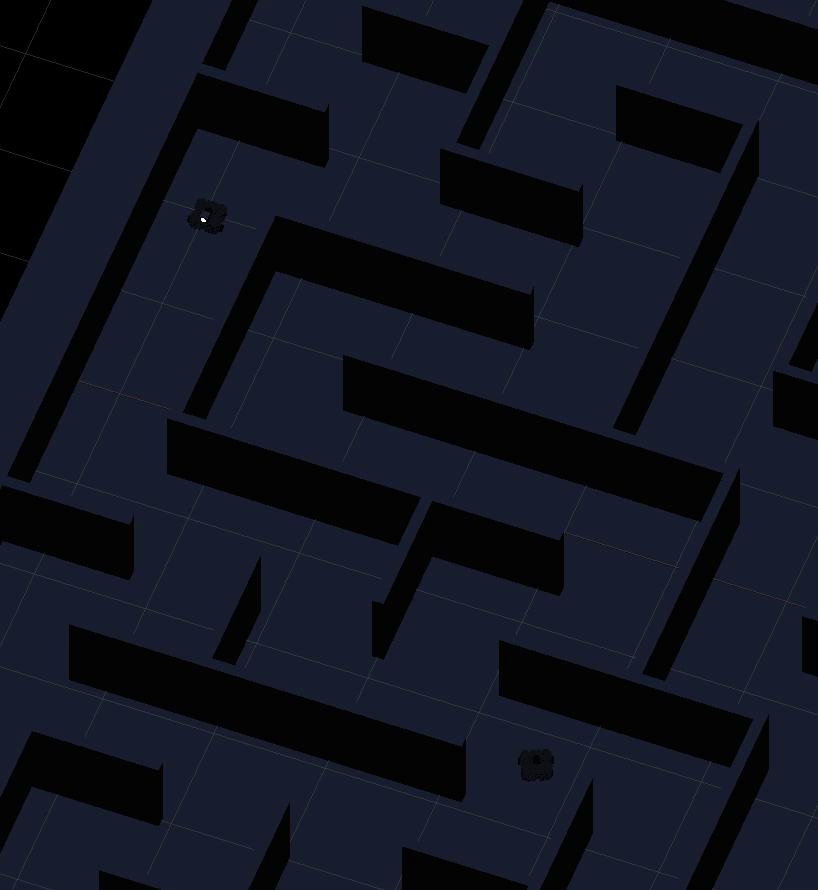

# LASER
### Light A* Search Evasion Routine

**Team Ribit 🐸: Hakim Lahlou, Jason Lin, Adam Weider, Kailin Wu**

## Project Description

Coming from similar backgrounds in game design, our team hopes to produce a game
using our knowledge of robotics algorithms. Our current idea is most similar to
a survival game: the player operates one TurtleBot in a dark maze while another
"monster" bot tries to approach the player. The monster knows the maze and the player's position at any time. A creature of the dark, this monster
cannot stay in the glow of the player's flashlight; thus, the monster bot has to
be smart in planning its path to the player.

The main components of our project are A* Search and Sensory Controls, a combination we've formulated as LASER: the Light A* Search Evasion Routine. The A* Search finds the best path from the monster to the player. The robot uses its Sensory Controls to traverse the maze, center itself in the maze hallways, avoid wall collisions, make smooth turns, and detect light. If the monster runs into the player's light, the A* Search takes this into account and recalculates the new best path to sneak up behind the player.

## How to Run LASER 

1) Clone this repository.
    ```
    $ git clone https://github.com/HDLahlou/robotics_final_project.git
    $ cd robotics_final_project
    ```

2) Install `pipenv`, which this project uses for local package management.
    ```
    $ pip3 install pipenv
    ```

3) Install the packages used by this project (specified in [`Pipfile`](../Pipfile)).
    ```
    $ pipenv install
    ```

4) Run ```catkin_make``` from your `catkin_ws/src` directory.
    ```
    $ cd ~/catkin_ws
    $ catkin_make
    ```
    
5) Run our ```setup.launch``` file, which must be run from outside the virtual environment.
    ```
    $ roslaunch robotics_final_project setup.launch
    ```

6) Open a new terminal, return to the project directory, launch a shell in the virtual environment containing the installed packages, and run our teleop controller.
    ```
    $ cd src/robotics_final_project
    $ pipenv shell
    $ rosrun robotics_final_project player.py
    ```

7) Unpause time in Gazebo.

8) Open a new terminal, launch a shell in the virtual environment again, and run our ```run.launch``` file to begin the autonomous bot’s algorithm.
    ```
    # pipenv shell
    $ roslaunch robotics_final_project run.launch
    ```

You can teleop the player robot and observe the monster robot's behavior. 

## Gazebo Environments


#### A looping track for tuning movement controls, and a maze for testing path-finding and light evasion.

We currently have two worlds for testing: [`turtlebot3_loop`](worlds/turtlebot3_loop.world),
which provides a simple looping track for tuning movement controls, and
[`turtlebot3_maze`](worlds/turtlebot3_maze.world), which contains an intricate
maze for testing path-finding and light evasion as involved in our project
idea. The maps contained in the above files were made in Blender, the looping
track manually, and the maze using an
[open-source plugin for maze creation](https://github.com/elfnor/mesh_maze).

### Gazebo Lighting (spoilers: not yet a success, but potentially a future one)


#### Comparison of native (top) and modified (bottom) spotlight shadow casting in Gazebo.

Our project hinges on dynamic lighting as detected by the robot. While Gazebo
simulates shadows for directional lights (e.g. the sun), it unfortunately does
not do so for spotlights and point lights. Such a revelation led to a very abrupt
introduction into Gazebo plugins and the associated C++ API; after a fair amount
of trial and error, we were able to write [our own plugin](plugins/custom_shadows.cpp)
for producing spotlight shadows, the results of which are demonstrated in the
latter of the above GIFs.

While the creation of our plugin seemed like the end to our issues, we later
discovered that we were only spawning the custom spotlight within Gazebo's
client application. On the server side responsible for simulating robot sensor
measurements, the light was not present, and thus it did not appear in the robot's
image feed. Opting to use a placeholder for lights, we put this task aside
in order to focus on sensory controls and the robot implementation itself.

## System Architecture

### Message Passing

Since we originally thought that the A* algorithm would take a nontrivial amount of
time to compute a path to the destination, we broke up our code into two nodes:
path navigation using sensory controls and the A* algorithm. A message passing
interface is necessary for the navigation node to request a path to follow
and for the A* node to send that path back to the navigation node.

#### Grid-Based Spatial Indexing

Code locations and descriptions
- [`msgs/Cell.msg`](scripts/Cell.msg)
  Our maze map is spatially indexed into a 13x13 grid of cells, each of which we can
  reference using row and column identifiers. We internally use the bot's current cell
  in all of our path-related algorithms to simplify our map space and lower the amount 
  of computation necessary.

#### Paths

Code locations and descriptions
- [`msgs/Path.msg`](scripts/Path.msg)
  A path is defined as a list of adjacent cells in the map. The A* algorithm will
  calculate the shortest path (fewest number of cells traversed) from a starting
  cell to a destination cell.

#### Path Requesting

Code locations and descriptions
- [`msgs/PathRequest.msg`](scripts/PathRequest.msg)
  Our navigation module has no map knowledge and can only determine its current cell,
  its destination cell, and cells that are obstructed due to light. When the robot
  is first initialized or needs to recompute a path, it sends a path request to our
  A* node containing the above information, then waits to receive a calculated path to 
  follow.

### A* Search Algorithm 

A* search is implemented in [`scripts/a_star.py`](scripts/a_star.py).

(Note: we describe the grid squares as "cells" in this document, but they may be referred to as "nodes" in the code; these terms can be used interchangeably.)

#### Initialization  

We initialize every grid square of the map as a `Cell()`, which has the following attributes. This information is stored in `cell_details` and is updated as the A* search is performed.

- `i`: row index

- `j`: column index

- `parent_i`: parent row index: 

- `parent_j`: parent column index

- `f`: equal to `g + h`; the algorithm processes the cell with the lowest f 

- `g`: number of cells traversed to get from the starting cell to this cell 

- `h`: estimated distance from this cell to the goal cell (the Manhattan distance between this cell and the goal) 
  
 #### Finding the best path 
  
The function `find_path` finds the shortest path from `starting_position` (monster's robot current cell) and `goal` (player's current cell). `open_list` and `closed_list` are  initialized as empty arrays; then, `starting_position` is appended to `open_list` 
    
 While the `open_list` is not empty, set `q` equal to cell with the smallest value of `f` in the `open_list`

- `q` has an array of four `successors` in the order of north, east, south, and west. Each successor is initialized as `-1`. 

- `check_north` checks if the robot can go north from `q`. The cell at `[2][2]` in the grid image has a successor to its north and its east, as indicated by the blue arrows. If the robot is not blocked by a wall, create a temporary cell equal to the `Cell` north of of `q`, and set `q` as its parent. Calculate the temporary cell's value of `g`, `h`, and `f`. Lastly, if this temporary cell is not blocked by light, we set the north successor of this cell equal to `temp_cell`. We determine this by looking at the provided values in `blocked_by_light` and seeing if it any of the entries within the list match the currently observed cell. Otherwise, the successor remains equal to `-1`.

- Repeat this process for the other directions with the functions `check_east`, `check_south`, and `check_west`. 

- For every valid successor:
          
 - If the successor is equal to `goal`, stop the search. 
    
 - If the successor has a lower value of `f` than the current `f` of the equivalent cell in `cell_details`, add the successor to `open_list` and update the cell in `cell_details` with the parameters of the successor.  
          
 - Push 'q' to the closed list 
    
When the search is completed, the function `trace_path` creates a list of best by starting at the `goal` cell in `cell_details` and tracing back through the parents until it reaches `starting_position`. Then, it publishes the path as a `Path.msg`. 

### Sensory Controls


#### TurtleBot3 running laps and evading ~~emissive spheres~~ lights.

The sensory controls for LASER consist of the following two components.

#### Movement Controls

Movement controls are responsible for keeping the bot on course in the current
environment. Within the above two tracks, this entails having the bot stay centered
between the two walls of the pathway, and performing turns when the path changes
directions. The controls aim to perform these tasks while still allowing the bot
to move decently quickly (in the above demonstrations, TurtleBot3 moves at 0.6 m/s).
In our current implementation, the bot uses odometry to follow a path calculated by the A* algorithm to reach a destination.

Code locations and descriptions
- [`scripts/navigate.py`](scripts/navigate.py)
  - Proportional control: [Lines 221–251 of `update(msg, model)`](https://github.com/HDLahlou/robotics_final_project/blob/main/scripts/navigate.py#L221-L251)
    Use odometry offsets to calculate a proportional control angular velocity 
    (`err_ang`) for the bot to face the next cell on the path it is following.
    Once the bot enters the cell it is trying to navigate to, begin angling it toward 
    the next cell on the path.
    
  - Reorientation (`FaceCell`, `ApproachCell`, `FaceHeading`): [Lines 274–323 of `update(msg, model)`](https://github.com/HDLahlou/robotics_final_project/blob/player-bot/scripts/navigate.py#L274-L323)
    When the bot recomputes a path to the destination, stop moving forward and turn to face
    the center of the cell.
    
    When the bot is facing the center of its current cell, move forward to reach the center.
    
    When the bot is in the center of its current cell, turn to face the next cell.
    
    If the bot is facing the next cell, switch to the `Drive` state for moving to it.
    
  - Driving forward (`Drive`): [Lines 325–364 of `update(msg. model)`](https://github.com/HDLahlou/robotics_final_project/blob/player-bot/scripts/navigate.py#L325-L364)
    If the bot's current heading is way off course, switch to the `Orient` state  
    to reorient it before continuing to follow the path.
    
    If the bot's heading is roughly in the same direction the next cell in the path
    is, calculate an additional positional error (`err_lin`, difference in distances 
    from the bot to left and right walls). Aggregate this with `err_ang` into a single 
    error value, compute angular velocity, and turn with such to correct orientation 
    while moving forward.

    If the direction is left or right, switch to the `Turn` state for performing
    a turn in said direction.

  - Performing turns (`Turn`): [Lines 291-296 of `update(msg, model)`](https://github.com/HDLahlou/robotics_final_project/blob/player-bot/scripts/navigate.py#L358-L364)
    If the bot is roughly facing the direction it is turning toward, switch to the
    `Drive` state because the turn is over.
    Otherwise, use `err_ang` to angle the bot to face the desired turn direction while 
    preserving linear velocity.

#### Simple Light Evasion

Due to aforementioned difficulty with Gazebo (and the reduced time frame of my
portion of the project), we are currently using emissive spheres as substitutes
for spotlights. While appearing bright, these do not cast light on other
objects. We thus leave robot inference (e.g. determining the presence of a light
around a corner via detection of diffused light) for later stages of the
project. Although a simpler task, the current setup provides a good environment
for unit testing the evasion of visible light sources. This evasion is
demonstrated, along with movement controls, in the second recording: TurtleBot
navigates the maze, quickly turning and retreating upon encountering two glowing
spheres. For demonstration purposes, a cube has been placed to obstruct one of
the pathways such that TurtleBot can only move back and forth between the two
spheres which it indefinitely avoids. In addition, we stop the autonomous
robot's movement ("Destination blocked") when it encounters a light in the cell
it is about to enter. This is because of the way we handle our pathfinding;
the A* algorithm blocks off a certain cell to prevent the robot from going through
it, but blocking off the same cell as the destination will lead to the robot being
unable to find a valid path.

Code locations and descriptions
- [`scripts/perception/light.py`](scripts/perception/light.py)
  - Detecting visible lights: `locate_brightest(img)`  
    Receive an image in BGR format. Pre-process the image by 1) converting it
    to grayscale and 2) applying Gaussian blur to smooth away high-value noise.
    Provide the pre-processed image to `cv2.minMaxLoc`, which returns the
    values and positions of the pixels in the image with minimum and maximum
    value (brightness). Return the value and position of the maximum value pixel.

- [`scripts/navigate.py`](scripts/navigate.py)
  - [Detecting visible lights: Lines 181–196 of `update(msg, model)`](https://github.com/HDLahlou/robotics_final_project/blob/player-bot/scripts/navigate.py#L366-L396)
    Call `locate_brightest` to find the value of the brightest pixel in the
    current view of the robot camera. If this value is greater than a set threshold
    for the brightness of a light, transition to the `FaceCell` state in order to
    calculate a new path to the destination and escape the light. If the brightest 
    pixel is under the threshold, assume there is no light in frame and do nothing.
    
### Player Input 

After testing the above components with stationary lights, we added a second robot which can be operated by the player. The player robot has a light sphere attached to the front of it that cannot be seen from behind. Because the A* search is very fast, the monster robot can quickly find new best paths as the player moves. The monster robot knows where the player is, but not the direction fo the player's light. So, if the monster robot runs into the player robot's light, it finds the next best path to the player in hopes of catching the player from behind.

Code locations and descriptions
- [`scripts/player.py`](scripts/player.py)
  - Player teleop controls:  
    A modification of the standard Turtlebot3 teleop controls with higher limits on maximum linear and angular velocity and publishers to our monster bot
    `cmd_vel` topic. The `s` key moves the robot backwards and the `x` key stops movement.
- [`scripts/navigation.py`](scripts/navigate.py)
  - [Query A* when the player changes cells: Lines 219–235 of `update(msg, model)`](https://github.com/HDLahlou/robotics_final_project/blob/main/scripts/navigate.py#L219-L235)
    Track the player bot's odometry to determine when it switches cells.
    Upon switching, send a new request from the monster bot to the A*
    algorithm for an updated path the player's new position.

## Challenges

As mentioned, Gazebo [intentionally
disables](https://git.lcsr.jhu.edu/dscl/ascent_mk2_hri2016/-/blob/7c4b3b55aea5c5831a919cc8c79cecba42c6f5f0/src/gazebo/gazebo/rendering/RTShaderSystem.cc#L454)
simulating shadows cast by spotlights and point lights. Dealing with this proved
frustrating, especially after a false sense of confidence in our ability to
create lights in Gazebo. Checking the Gazebo Answers forum, we noted a number of
[other
users](https://answers.gazebosim.org/question/26355/is-there-any-workaround-to-enable-shadows-for-point-lights-or-spot-lights/)
who were trying to work around the same design decision. Their posts helped
inform our own attempts to enable shadows (the post just linked was especially
informative for creating our plugin); however, being new to the Gazebo API, the
OGRE graphics engine, and even C++ as a language, we struggled a fair bit
through what essentially became a crash-course in creating Gazebo plugins. We
were eventually able to enable spotlight shadows, though once we observed the
robot camera feed in RViz, we realized that the lights were not visible to the
robot. Cue more Googling, and we then learned that robot sensor measurements are
handled on Gazebo's server application, and we were almost definitely spawning
our lights only on the client side (where they were visible to us using the
application). The work we put it in can perhaps still be salvaged, assuming we
can spawn corresponding lights on the server side; regardless, the endeavor
proved a time sink, one for which a good takeaway is in need. Ultimately, we decided to keep the light spheres; instead of sinking more times into experimenting with Gazebo plugins, we wanted to focus on the actual movement and search capabilities of the robot. 

Another major challenge was how to detect which sides of any given node are blocked by a wall when performing the A* search. We first tried to convert an `(x,y)` coordinate into its corresponding index of the OccupancyGrid() data array, `self.map.data`. However, trying to get this calculation proved to be extremely frustrating: `self.map.data` has a different origin than the true origin visualized in RViz. Additionally, the occupancy array is rotated from the map alignment we based the rest of our code off of, and it has to be scaled down with `self.map.info.resolution`. Our solution was to forgo doing these `(x,y)`-to-occupacy-grid conversions. Instead, we rotated `self.map.data` to match the orientation of the map, and called this rotated version `self.truemap`. We replaced the house map in the Particle Filter Project with our maze to help us visualize this rotation. The image below shows the `self.map.data` after we rotated it 90 degrees clockwise and scaled it down. (The origin doesn't match, but now that we are not using `(x,y)` values, it doesn't matter; this is just for ease of visualization). 


We use `self.map.info.resolution` to calculate how many indexes of the `self.truemap` array is equal to the length of a single grid square, `self.gridsize`. The function `node_to_occ` is basically a modified  2D-array-indices to 1d-array-index function. It takes the array indices `[i][j]` of a given maze cell and calculates the corresponding index in `self.truemap` with `self.gridsize`. Then, we were finally able to correctly identify which edges of a given maze cell are blocked by walls.  

## Takeaways

- Following the above dilemma with Gazebo, I believe my main takeaway for this
project would be: know that you can't know what you're getting yourself into. I
realize my wording is a bit repetitive, though I'm going for a play on "know
what you're getting yourself into." That suggestion comes from a place of good
faith; one *ought to* know the challenges that are in store if they choose a
certain path. However, I find that, especially in computer science and software
engineering, you sometimes can't say which challenges lie ahead. You can
approximate the sum difficulty of a given choice (e.g. before trying to enable
shadows, we knew it would be more difficult to do so than to use a placeholder
for lights). Yet once you've started down your path (I promise I'm not weaving a
a joke about path-finding into this), there may be a number of twists and turns
which you cannot foresee. In our case, those were 1) thinking light creation in
Gazebo a simple task, 2) learning shadow casting for our kind of lights was not
a simple task, 3) believing we had overcome the limitations of Gazebo with a
hack-around solution, and 4) realizing that only solved half the problem, and
not even the half which was most important for our project (having the robot see
the shadows). On such a twisty road, it's easy to look back and think that,
given the effort expended in traversing it thus far, it would be a shame to give
up short of the end. However, there could be three times the twists in the road
ahead. Really consider if you want to continue on that path, and be aware of
everything left unattended if you do choose to continue.

- Visualizing the occupancy array relative to our map was a major challenge. When our `check_north` and other wall-checking functions returned the wrong values, it was hard to discern why. Eventually, we had to swap the names of some of the functions in order to match the rotation of occupancy array. If we were to do a similar project in the future, we would write code that visualizes these kinds of functions. Creating an overlay of the map that places a red dot on the edges of cells blocked by walls would have helped us a lot in checking the accuracy the wall-checkers, for example. Having the visual would've saved us the time comparing the printed booleans of the wall-checker to the map.

## Future Work

The next step is to enhance the game aspects. We would create a first-person game view using the camera feed of the player robot, and augment this view using visual filters and sound effects. For example, sound could indicate that the monster is approaching, so the player would attempt to turn around and catch it in their light. We would also add more autonomous monster robots, perhaps some with different behavior than the one implemented so far.  

The TurtleBot3 teleop package uses a control scheme that varies from typical game controls in a few ways, so we would write a short script for more familiar teleop controls. We could ask team Controller Teleop about using their controller alongside our project!
  
## Demo
  
Our demo showcaseses a scenario where the autonomous bot attempts to pathfind to the player.
Upon reaching the corridor in which the player is located, the autonomous bot detects a light
and immediately begins calculating a new path to the player, turning around to follow that path.
When the player turns around and moves away, the autonomous bot detects a change in the player's
position and tries to chase it by assuming that the player is facing away and following its
original path. As the player moves through additional cells, the autonomous bot gains on it due
to its higher speed and turning capabilities, catching the player as they collide with a wall.


