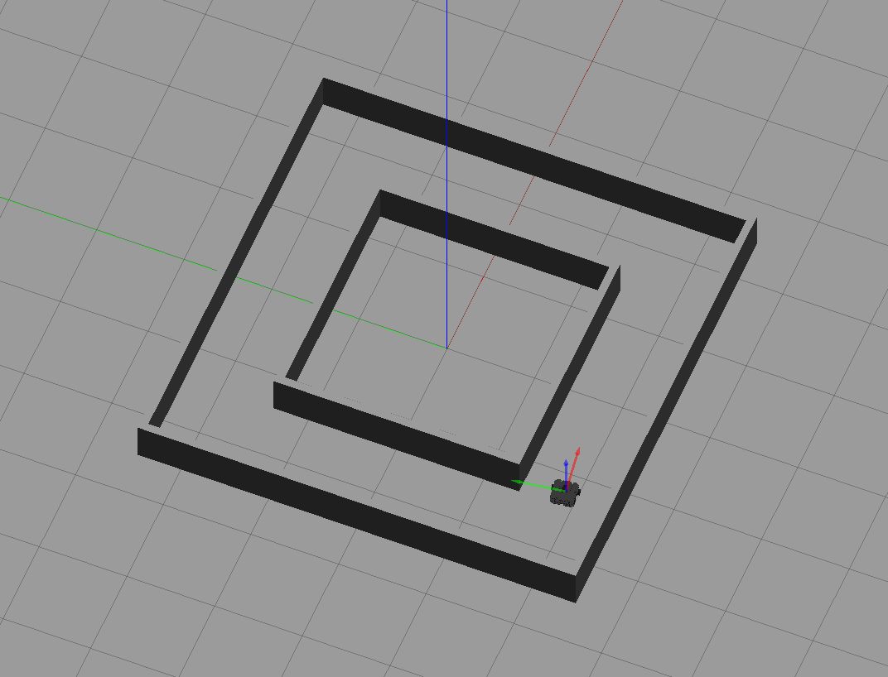

# LASER
### Light A* Search Evasion Routine

**Team Ribit 🐸: Hakim Lahlou, Jason Lin, Adam Weider, Kailin Wu**

## Project Description

Coming from similar backgrounds in game design, our team hopes to produce a game
using our knowledge of robotics algorithms. Our current idea is most similar to
a survival game: the player operates one TurtleBot in a dark maze while another
"monster" bot tries to approach the player. A creature of the dark, this monster
cannot stay in the glow of the player's flashlight; thus, the monster bot has to
be smart in planning its path to the player. We aim to implement such path-finding
using the A* search algorithm coupled with sensory controls, a combination we've
formulated as LASER: the Light A* Search Evasion Routine.

For my one week [graduating student] project milestones, I've tried to lay the
groundwork for environment creation and sensory robot controls, which are
described in the following section.

## System Architecture

### Gazebo Environments

#### A looping track for tuning movement controls, and a maze for testing path-finding and light evasion.

We currently have two worlds for testing: [`turtlebot3_loop`](worlds/turtlebot3_loop.world),
which provides a simple looping track for tuning movement controls, and
[`turtlebot3_maze`](worlds/turtlebot3_maze.world), which contains an intricate
maze for testing path-finding and light evasion as involved in our project
idea. The maps contained in the above files were made in Blender, the looping
track manually, and the maze using an
[open-source plugin for maze creation](https://github.com/elfnor/mesh_maze).

### Gazebo Lighting (spoilers: not yet a success, but potentially a future one)

#### Comparison of native (top) and modified (bottom) spotlight shadow casting in Gazebo.

Our project hinges on dynamic lighting as detected by the robot. While Gazebo
simulates shadows for directional lights (e.g. the sun), it unfortunately does
not do so for spotlights and point lights. Such a revelation led to a very abrupt
introduction into Gazebo plugins and the associated C++ API; after a fair amount
of trial and error, we were able to write [our own plugin](plugins/custom_shadows.cpp)
for producing spotlight shadows, the results of which are demonstrated in the
latter of the above GIFs.

While the creation of our plugin seemed like the end to our issues, we later
discovered that we were only spawning the custom spotlight within Gazebo's
client application. On the server side responsible for simulating robot sensor
measurements, the light was not present, and thus it did not appear in the robot's
image feed. Opting to use a placeholder for lights, we put this task aside
in order to focus on sensory controls and the robot implementation itself.

### Sensory Controls

#### TurtleBot3 running laps and evading ~~emissive spheres~~ lights.

The sensory controls for LASER consist of the following two components.

#### Movement Controls

Movement controls are responsible for keeping the bot on course in the current
environment. Within the above two tracks, this entails having the bot stay centered
between the two walls of the pathway, and performing turns when the path changes
directions. The controls aim to perform these tasks while still allowing the bot
to move decently quickly (in the above demonstrations, TurtleBot3 moves at 0.6 m/s).
Although currently a standalone implementation, we hope to have movement controls
operate alongside A* path-finding in our final product.

Code locations and descriptions
- [`scripts/sensor_nav.py`](scripts/sensor_nav.py)
  - Driving forward: Lines 207-259 of `update(msg. model)`  
    Select the longest LiDAR ranges from the front-left and front-right of the
    robot. For each side, if the longest range is greater than a threshold
    distance, consider it possible to turn in that direction. If there is not a
    wall in front of the bot, consider it possible to continue moving forward as
    well.

    If no directions are considered possible, then stop moving. Otherwise, randomly
    choose a direction (we'll later use A* specifying directions; random assignment
    is only for this demonstration).

    If that direction is forward, compute angular error (angular difference between
    shortest range to wall and right angles on sides of the bot) and positional
    error (difference in distances from the bot to left and right walls). Aggregate
    these into a single error value, compute angular velocity, and turn with such
    to correct orientation while moving forward.

    If the direction is left or right, switch to the `Turn` state for performing
    a turn in said direction.

  - Performing turns: Lines 261-288 of `update(msg, model)`  
    Check if LiDAR ranges on the side to which the bot is turning are under
    a set distance long (implying the robot is now adjacent to a wall on that
    side) and if the closest object in front of the robot is far away (implying
    the robot is now facing the empty hallway it has entered). If these conditions
    hold, the turn is over, and switch to the `Drive` state. Otherwise, execute
    the turn with a fixed angular and linear velocity.

#### Simple Light Evasion

Due to aforementioned difficulty with Gazebo (and the reduced time frame of my
portion of the project), we are currently using emissive spheres as substitutes
for spotlights. While appearing bright, these do not cast light on other
objects. We thus leave robot inference (e.g. determining the presence of a light
around a corner via detection of diffused light) for later stages of the
project. Although a simpler task, the current setup provides a good environment
for unit testing the evasion of visible light sources. This evasion is
demonstrated, along with movement controls, in the second recording: TurtleBot
navigates the maze, quickly turning and retreating upon encountering two glowing
spheres. For demonstration purposes, a cube has been placed to obstruct one of
the pathways such that TurtleBot can only move back and forth between the two
spheres which it indefinitely avoids.

Code locations and descriptions
- [`scripts/perception/light.py`](scripts/perception/light.py)
  - Detecting visible lights: `locate_brightest(img)`  
    Receive an image in BGR format. Pre-process the image by 1) converting it
    to grayscale and 2) applying Guassian blur to smooth away high-value noise.
    Provide the pre-processed image to `cv2.minMaxLoc`, which returns the
    values and positions of the pixels in the image with minimum and maximum
    value (brightness). Return the value and position of the maximum value pixel.

- [`scripts/sensor_nav.py`](scripts/sensor_nav.py)
  - Detecting visible lights: Lines 290-306 of `update(msg, model)`  
    Call `locate_brightest` to find the value of the brightest pixel in the
    current view of the robot camera. If this value is greater than a set threshold
    for the brightness of a light, transition to the `Spin` state in order to
    face away from and escape the light. If the brightest pixel is under the
    threshold, assume there is no light in frame and do nothing.

  - Evading visible lights: Lines 313-336 of `update(msg, model)`  
    Compute an error factor between the current direction of the robot and the
    direction in which to escape from the light. If that error is approximately
    zero, switch to the `Drive` state to begin the movement away from the light.
    Otherwise, compute an angular velocity proportional to the error, and spin
    around with that velocity.

## Challenges

As mentioned, Gazebo [intentionally
disables](https://git.lcsr.jhu.edu/dscl/ascent_mk2_hri2016/-/blob/7c4b3b55aea5c5831a919cc8c79cecba42c6f5f0/src/gazebo/gazebo/rendering/RTShaderSystem.cc#L454)
simulating shadows cast by spotlights and point lights. Dealing with this proved
frustrating, especially after a false sense of confidence in our ability to
create lights in Gazebo. Checking the Gazebo Answers forum, we noted a number of
[other
users](https://answers.gazebosim.org/question/26355/is-there-any-workaround-to-enable-shadows-for-point-lights-or-spot-lights/)
who were trying to work around the same design decision. Their posts helped
inform our own attempts to enable shadows (the post just linked was especially
informative for creating our plugin); however, being new to the Gazebo API, the
OGRE graphics engine, and even C++ as a language, we struggled a fair bit
through what essentially became a crash-course in creating Gazebo plugins. We
were eventually able to enable spotlight shadows, though once we observed the
robot camera feed in RViz, we realized that the lights were not visible to the
robot. Cue more Googling, and we then learned that robot sensor measurements are
handled on Gazebo's server application, and we were almost definitely spawning
our lights only on the client side (where they were visible to us using the
application). The work we put it in can perhaps still be salvaged, assuming we
can spawn corresponding lights on the server side; regardless, the endeavor
proved a time sink, one for which a good takeaway is in need.

Another major challenge was how to detect which sides of any given node are blocked by a wall. OccupancyGrid() data array is is both rotated 90 degrees and has a different origin than the RViz visualization of the map. 

## Takeaways

Following the above dilemma with Gazebo, I believe my main takeaway for this
project would be: know that you can't know what you're getting yourself into. I
realize my wording is a bit repetitive, though I'm going for a play on "know
what you're getting yourself into." That suggestion comes from a place of good
faith; one *ought to* know the challenges that are in store if they choose a
certain path. However, I find that, especially in computer science and software
engineering, you sometimes can't say which challenges lie ahead. You can
approximate the sum difficulty of a given choice (e.g. before trying to enable
shadows, we knew it would be more difficult to do so than to use a placeholder
for lights). Yet once you've started down your path (I promise I'm not weaving a
a joke about path-finding into this), there may be a number of twists and turns
which you cannot foresee. In our case, those were 1) thinking light creation in
Gazebo a simple task, 2) learning shadow casting for our kind of lights was not
a simple task, 3) believing we had overcome the limitations of Gazebo with a
hack-around solution, and 4) realizing that only solved half the problem, and
not even the half which was most important for our project (having the robot see
the shadows). On such a twisty road, it's easy to look back and think that,
given the effort expended in traversing it thus far, it would be a shame to give
up short of the end. However, there could be three times the twists in the road
ahead. Really consider if you want to continue on that path, and be aware of
everything left unattended if you do choose to continue.

## Future Work

This document represents a snapshot of our project one week before the final
product. A brief overview of remaining tasks is as follows.

#### Light Emission, Detection, and Reaction
- Add operations for inferring the placement of a light given the lighting of
  the robot's surroundings (i.e. infer light placement without seeing the light
  itself).
- Combine A* path-finding on a static map with dynamic measurements about
  lights within that map.

#### Path-finding and Navigation
- Create a map image file (like we used in the particle filter project) for our
  Gazebo environment.
- Implement A* search and use the above map as input for computing paths.
- Communicate paths to the sensory control system using serialized directions
  that tell the robot which way to move at each junction.

#### Working in Gazebo
- Following the discussion about shadow simulation, perhaps try to work around
  the client/server issue with more Gazebo plugin wizardry (or heed our own takeaway
  and don't spend much more time on this).

#### Stretch Goals
- Attach the light to a robot which can be teleoperated by a human player.
- Create a first-person game view using the camera feed of the teleop robot.
  Augment this view using visual filters and sound effects.
- Write a short script for more familiar teleop controls (the TurtleBot3 teleop
  package uses a control scheme that varies from typical game controls in a few
  ways). Possibly ask team Controller Teleop about using their controller
  alongside our project.
